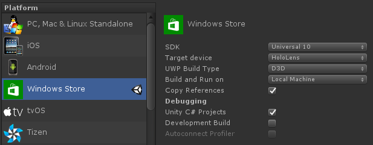

# HoloFirst

## Setting Up

Install the tools required by Microsoft [here](https://developer.microsoft.com/en-us/windows/holographic/install_the_tools#installation_checklist)

Last tested versions were
- [Visual Studios 2015 Update 3](https://www.visualstudio.com/post-download-vs/?sku=community&clcid=0x409&telem=ga)
  - With Windows 10 SDK
  - With Universal Windows App Development Tools
- [Unity 5.4.0f3-HTP](http://beta.unity3d.com/download/b21dfedb4779/UnityDownloadAssistant.exe?_ga=1.101692035.341886031.1470231455)
  - With Windows Store .NET Scripting Backend
- [Hololens Emulator b10.0.14393.0](http://go.microsoft.com/fwlink/?LinkID=823018)

Download the server and it's requirements [here](https://github.com/rp-first/NetTableToSocket)

**Note:** *Unity 5.5.0f3 is the recommended version but there are currently some issues
with the HoloInputModule while testing within the editor. Testing on the device/emulator
appears to be fine.*

### Hardware Requirements

- Windows 8+ (64-bit Windows 10 Pro, Enterprise, or Education recommended)
- RAM 4GB+ (Minimally 8GB for emulator)
- GPU should support DX11 (Recommended GTX 760+, AMD Radeon HD 7970+, or equivalent)

**Note:** *GPU and RAM recommendations were not tested but are an estimate of
what should work.*

## Using the Example

To get started, open Unity using the `src` folder. After unity is done importing
the assets you can navigate to `Assets/Example/Scenes` and open FieldPlacementExample.
This scene gives an example of placing a model with annotations.

The controls while in the Unity editor play mode are:
- Mouse left click as tap, mouse cursor is the target
- Ctrl+Mouse move to rotate the view
- `WASD` keys to move around

To test on the device, open the build menu, `File > Building Settings...`. The
platform should be set to Windows Store, SDK to Universal 10, UWP build type to
D3D, and  Unity C# Projects checked.



It will ask you for a folder to build out to. Once it's built, open the Visual
Studio project in the exported folder. Finally build and deploy it, there are
a few ways to do this, detailed by Microsoft
[here](https://developer.microsoft.com/en-us/windows/holographic/holograms_100#chapter_5_-_build_and_deploy)
 in Chapter 5.

 When the app opens on the device, tap to pin the window to a surface. The top-left
 corner of the window has a pencil icon, when clicked will start the alignment process.
 This will show a transparent market. Tap to place the markers in the order
 shown below:
   1. Where the corner of the driverstation wall meets the floor in the red retrieval zone
   2. Where the corner of the driverstation wall meets the floor in the blue key
   3. Where the corner of the driverstation wall meets the floor in the the red key
   4. Where the corner of the driverstation wall meets the floor in the red retrieval zone

Note: When placing the field in an open space, pick a rectangle on the ground and place the pins at the four corners in a clockwise direction. The software will do a best fit placement even if the rectangle you pick is much smaller than the actual field.

 

If the tip of the pins aren't exactly where you want them, keep your fingers pinched 
and drag up/down/left/right/in/out to adjust them to the desired spot on the ground. Getting 
your head closer to the ground will help you see if the tip of the pin is touching the ground 
or just above the ground. After placing the last pin you should see the field model.

### Pushing data from robot

The server integrates with smart dashboard and the code/instructions can found [here](https://github.com/rp-first/NetTableToSocket).

### Using the robot data

The data is pushed to `UWPServer` and lets you subscribe via the `Publisher` field.

```csharp
using UnityEngine;
using FirstUtilities;
using NamedMessageValuesExtention;

class DebugSubscribe : MonoBehaviour {
  void Start() {
    UWPServer.Publisher.subscribe(MessageEnum.ValueName,onValueNameUpdate);
  }

  void onValueNameUpdate(ValueItem vi) {
    Debug.Log(vi.name + ": " + vi.value.ToString());
  }
}
```
To simply add text values to the 3D world in Unity, there is a component called
`SimpleSubscribeLabel`. It lets you assign 2 Text components, one for the name and
the other for the value. It also has a drop-down choose which value to subscribe to.

The namespace `NamedMessageValuesExtention` adds the enum `MessageEnum`. This allows
you to subscribe based on the name of the value you want. When the value name changes
or is removed you will get a compile time error. You may also subscribe via an index
which is dependent on how many values are in the message.

### Changing data pushed

Edit/Replace the XML file for the message definition under `Assets/Resources/Config/message_config.xml`. You will also need to update this
for the server.

```xml
<?xml version="1.0"?>
<config>
	<table_host value="x.x.x.x" />  <!-- IP address to smart dashboard host -->

	<comm_mode value="TCP" />       <!-- TCP or UDP (anything other than TCP means use UDP) -->
	<dest_host value="127.0.0.1" /> <!-- IP to Unity app -->
	<dest_port value="8765" />      <!-- Port on Unity app's host -->

	<message>
	     <value name="Auton Enabled: " 		type="boolean" 	default="false" />
	     <value name="Auton Delay: " 		type="float" 	default="0.0" />
	     <value name="vision range" 		type="float" 	default="-999.0" />
	     <value name="vision azimuth" 		type="float" 	default="-999.0" />
	     <value name="vision recognized" 	type="boolean" 	default="false" />
	     <value name="Drv gyro act" 		type="float" 	default="0.0" />
	</message>
</config>
```

After a change is made the editor should regenerate the MessageEnum located at `Assets/FirstHolo/Scripts/RobotConnect/MessageEnum.cs`. If this does not happen you
may force it to regenerate with the menu item "*First > Rebuild MessageEnum*".

The types of data that can be pushed include:

- `bool`, `boolean`
- `float`, `single`
- `double`
- `short`, `int16`
- `int`, `int32`
- `long`, `int64`

### Testing within the Editor

The project can receive network data from the server while within the Unity Editor.
If you can't run the server the `UWPServer` lets you enable the bool `emulateFromEditor`
and the server will at least push the default values once. In the future there are
plans that this will allow a random stream of updates.

If the program throws an exception and is unable to shutdown correctly in the Editor
then Unity might hang as the network listener thread may not have shutdown.

### Arena Alignment and Recognition

The HoloLens is able to overlay 3D models atop the real objects by aligning points specified in a 3D model with points chosen by the user on the HoloLens at runtime.  Once the alignment is complete, the HoloLens will save this information and automatically recognize the model location.

The tracking system requires two or more points to align the field, but a minimum of 3 points is recommended.  Ideally, points should be placed at the further ends of the model to reduce jitter and increase accuracy of the alignment.

The `TrackableLocation` component is used to specify a region of space that can be aligned with the real world.  Feature points are specified to align the space as well as locate the location at runtime.  Note that `TrackableLocation` uses the underlying `WorldAnchor` component and therefore when it is anchored (this occurs after it has been aligned) the `TrackableLocation` will not be moveable.

The `AlignmentManager` is responsible for performing initial alignment and realignment of a `TrackableLocation`.  The `Align` or `ToggleAlignment` function should be called with the corresponding `TrackableLocation` reference.  Once called, the HoloLens user will place beacons in the real world that correspond to the points specified in the `TrackableLocation`.  These beacons will adhere to the world surface and are placed by air tapping.  A single air tap will place the beacon, but holding the tap and dragging the hand will allow for fine tuning of the beacon placement.

### Speech

`SpeechRecognizer` is a wrapper around the SpeechRecognition APIs that allows for the definition of simple command phrases and associated actions.  Simply define a word or phrase and assign a `SpeechAction` within the editor.  When that phrase is recognized, that event will be triggered.

In the example there are 3 phrases available:
- "unpin window" - Unpins the window and brings it to you
- "lock window" - pins the window in place
- "red rover" - same as unpin window

These can be seen on the `SpeechRecognizer` object in the scene root.

### HoloHuD

An experimental heads up display is provided with the `HoloHud` component.  This allows UI elements to be placed persistently within the user's field of view.  Note that a persistent HUD can cause disorientation if not constructed properly, so it is recommended to use this component with caution.

THe `HoloHud` matches HoloLens screen dimension and is placed at a configurable distance from the user's camera at all times.  Margins can be adjusted to extend the HUD outside of the user's field of view.  Placing elements in the margins can be keep the user's gaze clear of distractions while providing quick access to information at a glance.


# License

Copyright © 2016 United States Government as represented by the Administrator of the National Aeronautics and Space Administration. All Rights Reserved.
